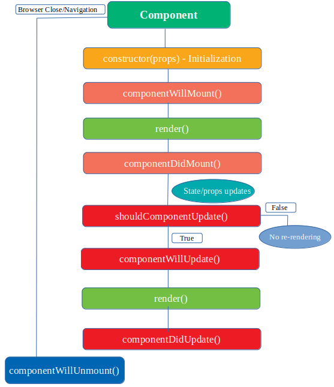

# React

## Main Concepts

### jsx

is an extinsion of js allow us to write what the ui look like in js file

```js
const element = <h1>Hello, {name}</h1>;
```

### JSX is an Expression Too

After compilation, JSX expressions become regular JavaScript function calls and evaluate to JavaScript objects.

    React DOM uses camelCase property naming convention instead of HTML attribute names. className , tabIndex.

> **Babel** compiles JSX down to React.createElement() calls.

```js
<h1 className="greeting">Hello, world!</h1>;

// React elements
// object describe what you want to see
const element = {
  type: "h1",
  props: {
    className: "greeting",
    children: "Hello, world!",
  },
};
```

## Elements

Elements are the smallest building blocks of React apps.

to render elemnet

```js
(element , entry point)
ReactDOM.render(element, document.getElementById("root"));

```

> **React Only Updates What’s Necessary**

> React DOM compares the element and its children to the previous one, and only applies the DOM updates necessary to bring the DOM to the desired state.

## Components

split ui into

- independent.
- reusable pieces.
- isolated piece

#### How to create component ?

- **Functional Component => java script function accept props and return jsx element**

```js
function Welcome(props) {
  return <h1>Hello, {props.name}</h1>;
}
```

- **Class Component => ES6 js class**

```js
class Welcome extends React.Component {
  render() {
    return <h1>Hello, {this.props.name}</h1>;
  }
}
```

```js
function Welcome(props) {
  return <h1>Hello, {props.name}</h1>;
}

const element = <Welcome name="Sara" />;
ReactDOM.render(element, document.getElementById("root"));

// 1-We call ReactDOM.render() with the <Welcome name="Sara" /> element.
// 2-React calls the Welcome component with {name: 'Sara'} as the props.
// 3-Our Welcome component returns a <h1>Hello, Sara</h1> element as the result.
// 4-React DOM efficiently updates the DOM to match <h1>Hello, Sara</h1>.
```

    Always start component names with a capital letter.

### Extracting Components

split components into smaller components.

    A good rule of thumb is that
    - if a part of your UI is used several times (Button, Panel, Avatar)
    - is complex enough on its own (App, FeedStory, Comment),
     it is a good candidate to be extracted to a separate component.

> All React components must act like pure functions(never change / update its props ) with respect to their props.
>
> > "Props are read only"

## State

represent an information about the component's current situation
like a variable but changing state cause a rerender for component .

## Life Cycle

Mounting > when react add the component to dom
ummounting > when the component removed from dom

### ComponentDidMount 
runs after the component has been rendered to the DOM
Good Place to set Timmerts , Fetch data as it run once .


when calling a component 

1- compoenet **initialized its state** .

2- call **render** and render the component with current values.

3- call **componentDidMount** apply its code and if  state changed inside it react call render 

4- if the component removed from dom react call component willun mount() 


    - initialization > in which the component is going to start its journey by setting up the state and the props
----------
    - mounting > is the phase in which our React component mounts on the DOM (i.e., is created and inserted into the DOM).

    these two functions called Once  
    1. componentWillMount() before a component mounts on the DOM or the render method is called. After this method, the component gets mounted.
    // Do not  chnage in data or state as it's not applied because component doesnot mounted yet.

    2. componentDidMount()  is called after the component gets mounted on the DOM 
    // best place to apply state change of fetch data.
-----------------
    updating
    This is where component’s state changes and hence, re-rendering takes place.
    1.shouldComponentUpdate(nextProps,nextState)
    determines whether the component should be updated or not. By default, it returns true. But at some point, if you want to re-render the component on some condition.

    2. componentWillUpdate(nextProps,nextState)
    It is called before the re-rendering of the component takes place. It is called once after the ‘shouldComponentUpdate’ method. If you want to perform some calculation before re-rendering of the component and after updating the state and prop, then this is the best place to do it.

    3. ComponentDidUpdate(nextProps,nextState)
    after the re-rendering of the component.
---
    unmounting 
    he component gets unmounted from the DOM in this phase
    1. componentWillUnmount()
    called before the unmounting of the component takes place. Before the removal of the component from the DOM
    good place to clean up compoenent .


